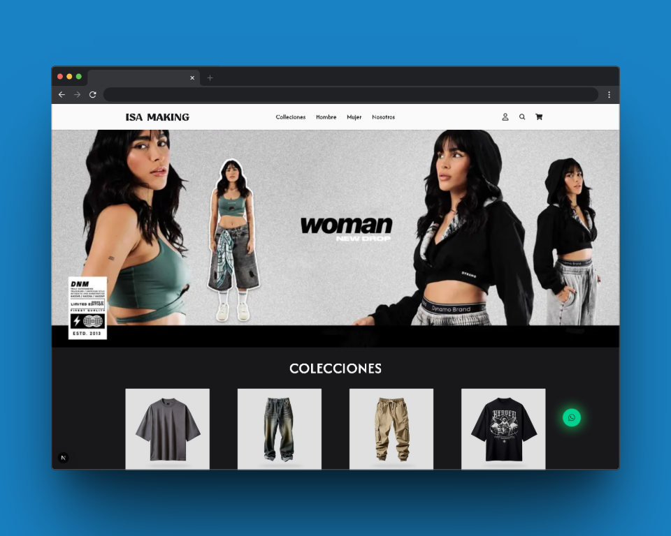
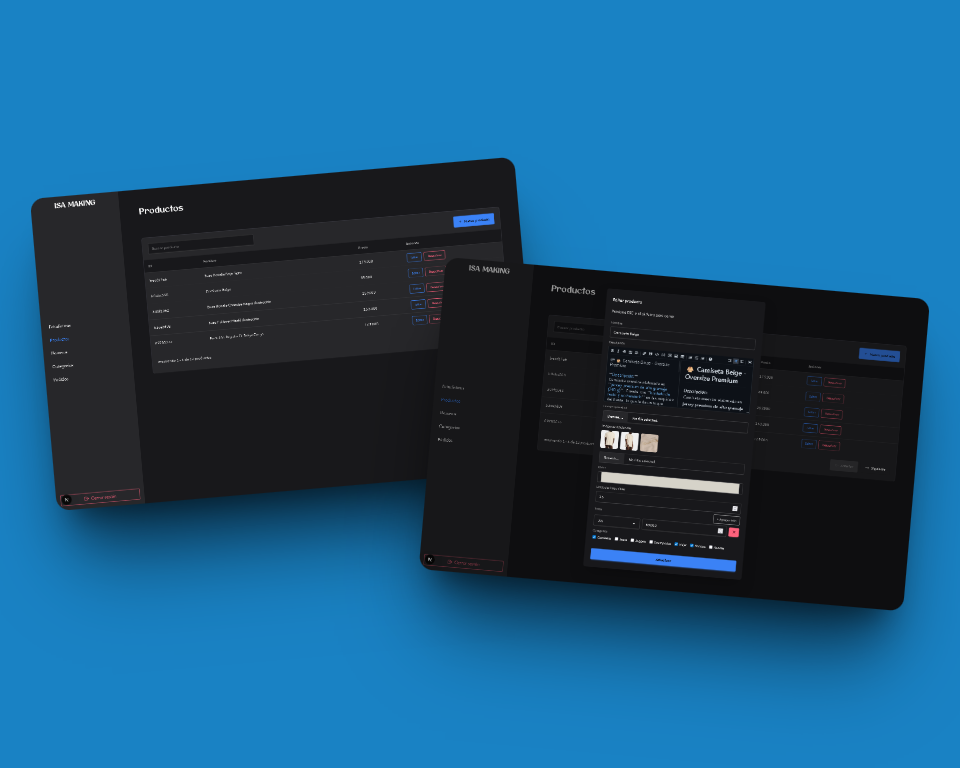
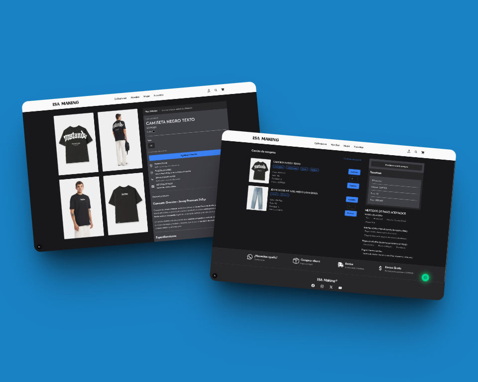
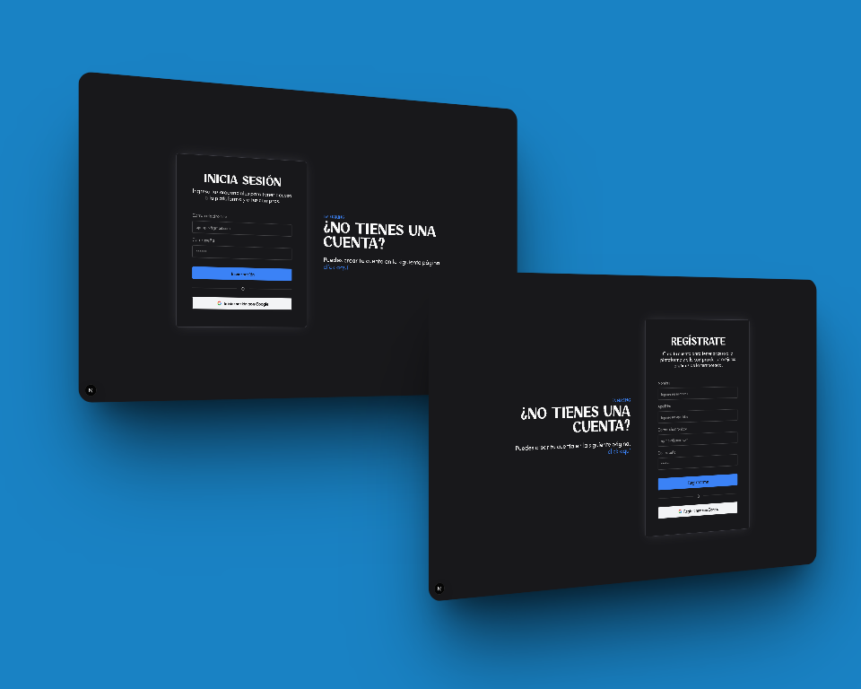
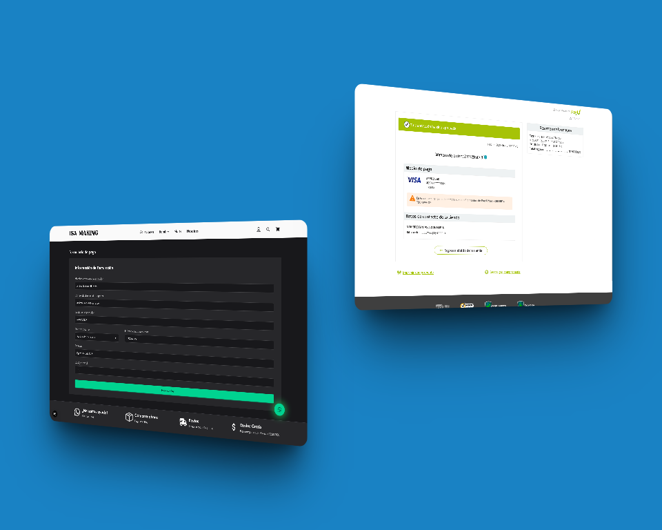
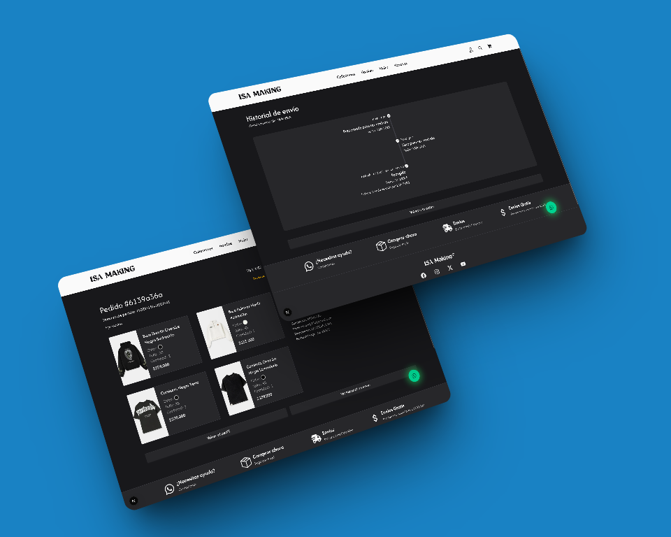
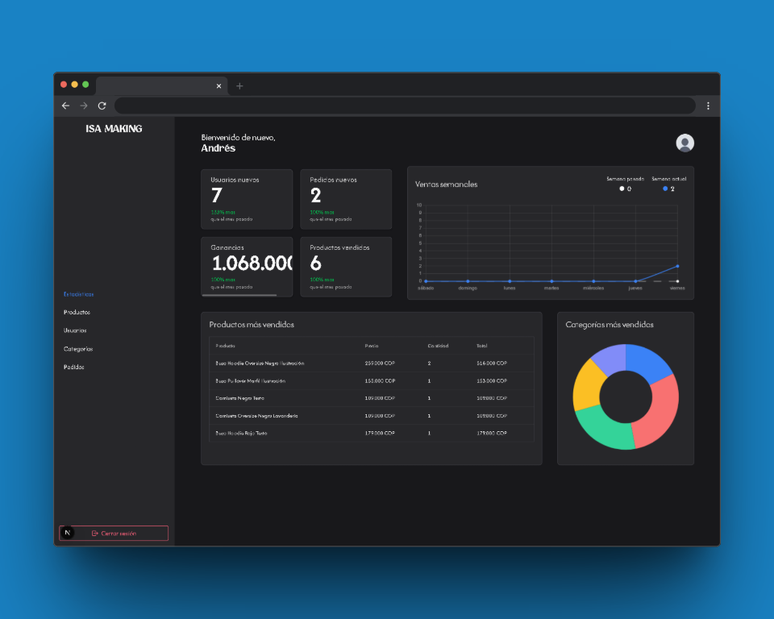
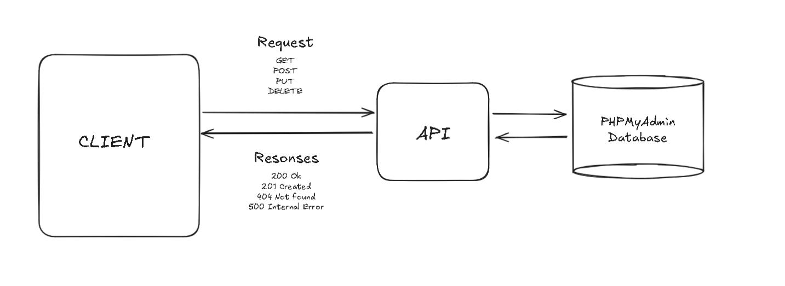

# 🛍️ ISA Making

[English Version](README.md)

[Cellphone Version](https://github.com/AndresGutierrezHurtado/isa-making-mobile)

ISA Making es un sistema de información diseñado para gestionar todo el flujo de trabajo de comercio electrónico, desde la selección y personalización de productos hasta el pago y el seguimiento de la entrega. Permite a los usuarios agregar productos a un carrito, completar pagos seguros y monitorear el estado del envío a través de servicios como Interrapidísimo. Los administradores tienen control total sobre la gestión de productos y actualizaciones de inventario.



---

## 📑 Tabla de Contenido

1. [Características Clave](#-características-clave)
2. [Stack Tecnológico](#-stack-tecnológico)
3. [Arquitectura del Sistema](#%EF%B8%8F-arquitectura-del-sistema)
4. [Flujos del Sistema](#-flujos-del-sistema)
5. [Instalación](#%EF%B8%8F-instalación)
6. [Contacto](#-contacto)

---

## 🚀 Características Clave

El sistema proporciona las siguientes funcionalidades clave:

---

### 🧥 Gestión de Productos

- Control de inventario y disponibilidad
- Interfaz de administración para operaciones CRUD de productos



---

## 🛒 Compra de Productos

- Proceso de pago seguro con múltiples opciones de pago
- Seguimiento de pedidos en tiempo real y actualizaciones de estado
- Integración con proveedores de envío para una entrega eficiente



---

### 🔐 Autenticación

- Inicio de sesión seguro a través de credenciales
- Integración de OAuth con Google



---

### 💳 Pasarela de Pago Integrada

- Integración de PayU para procesamiento de pagos en tiempo real
- Flujo de transacciones seguras con manejo de éxito/fallo



---

### 🚚 Seguimiento de Envío

- Los administradores actualizan el estado del producto basado en las actualizaciones de seguimiento de envío



---

### 📈 Análisis e Insights

- Ventas y análisis
- Monitoreo del rendimiento del producto
- Insights sobre el comportamiento del cliente
- Visualización de datos para una toma de decisiones informada



---

## 💻 Stack Tecnológico

### **Frontend**

- **Next.js 15**
- **Tailwind CSS v4**
- **DaisyUI**
- **react-chartjs-2**
- **Valibot**

### **Backend**

- **Next.js API (App Router)**
- **Sequelize CLI + MySQL**
- **Pasarela de Pago PayU**

---

## 🏗️ Arquitectura del Sistema

ISA Making sigue una **arquitectura cliente-servidor**, con una clara separación entre las capas de frontend y backend. La comunicación ocurre a través de solicitudes HTTP y puntos finales de API, asegurando escalabilidad, mantenibilidad y experiencias de usuario dinámicas.

> **Frontend:** Ofrece una interfaz de usuario interactiva y receptiva  
> **Backend:** Maneja la lógica de negocio, autenticación, pagos y operaciones de base de datos



---

## 🔄 Flujos del Sistema

### **🚶‍♂️ Flujo de Usuario**

1. **Inicio de Sesión** – Los usuarios inician sesión usando credenciales o OAuth de Google/Behance
2. **Explorar Productos** – Explorar el catálogo de productos con vistas detalladas y opciones de personalización
3. **Agregar al Carrito** – Agregar prendas con atributos seleccionados al carrito
4. **Pago** – Completar el pago a través de la integración de PayU
5. **Seguimiento de Envío** – Monitorear el progreso de la entrega después de la compra

---

### **🚧 Flujo de Administrador**

1. **Gestionar Productos** – Agregar, editar o eliminar productos
2. **Personalizar Opciones** – Configurar las características de personalización disponibles (categorías)
3. **Monitorear Pedidos** – Revisar el historial de compras y el estado de entrega
4. **Ver Estadísticas** – Acceder a estadísticas de ventas y análisis para una mejor toma de decisiones

---

## 🛠️ Instalación

Sigue estos pasos para ejecutar ISA Making localmente:

### **Requisitos Previos**

- Node.js >= 18
- Base de Datos MySQL
- Credenciales de prueba/sandbox de PayU

### **Pasos**

1. **Clonar el repositorio**

    ```bash
    git clone https://github.com/AndresGutierrezHurtado/isa-making.git
    cd isa-making
    ```

2. **Instalar dependencias**

    ```bash
    npm install
    ```

3. **Configurar variables de entorno**

    Copia el archivo `.env.example` para crear un archivo `.env`:

    ```bash
    cp .env.example .env
    ```

    Luego, agrega tu configuración al archivo `.env`.

4. **Crear la base de datos en PHPMyAdmin**
    ```SQL
    CREATE DATABASE `isa_making`
    ```
5. **Ejecutar migraciones de base de datos**

    ```bash
    npm run db:migrate && npm run db:seed
    ```

6. **Iniciar el servidor de desarrollo**

    ```bash
    npm run dev
    ```

---

## 📬 Contacto

Para preguntas, soporte o colaboración, por favor contacta:

- Andrés Gutiérrez Hurtado
- Correo: [andres52885241@gmail.com](mailto:andres52885241@gmail.com)
- GitHub: [@AndresGutierrezHurtado](https://github.com/AndresGutierrezHurtado)
- LinkedIn: [Andrés Gutiérrez](https://www.linkedin.com/in/andr%C3%A9s-guti%C3%A9rrez-hurtado-25946728b/)
