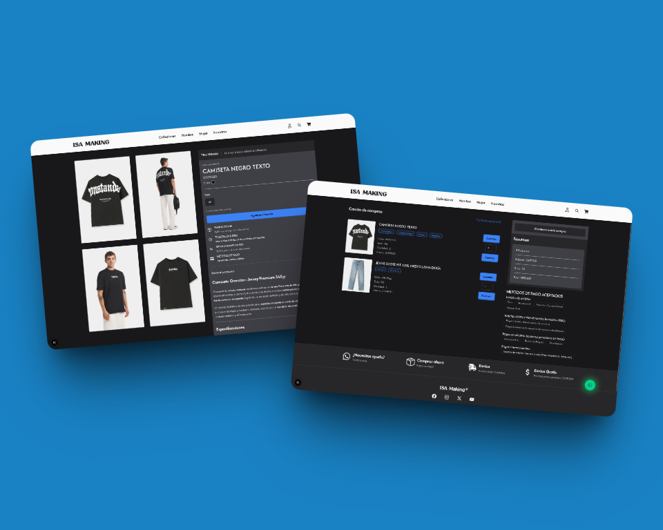
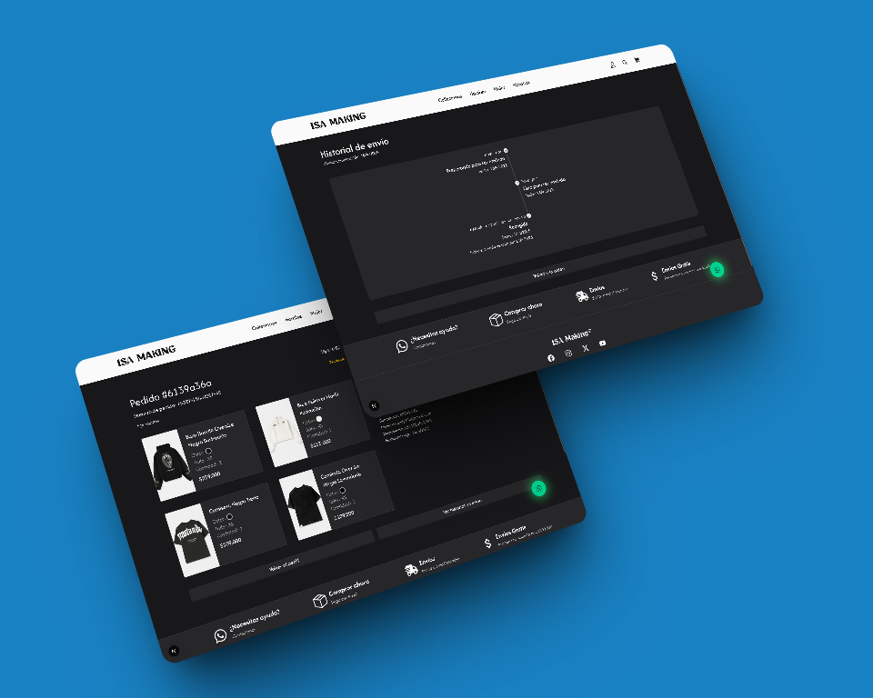
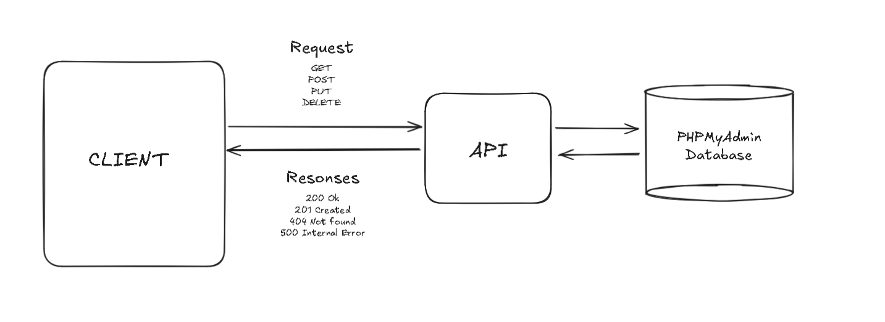

# 🛍️ ISA Making

[Versión en Español](README.es.md)

ISA Making is an information system designed to manage the entire e-commerce workflow — from product selection and customization to payment and delivery tracking. It allows users to add products to a cart, complete secure payments, and monitor shipping status via services like Interrapidísimo. Administrators have full control over product management and inventory updates.


---

## 📑 Table of Contents

1. [Key Features](#-key-features)
2. [Tech Stack](#-tech-stack)
3. [System Architecture](#%EF%B8%8F-system-architecture)
4. [System Workflows](#-system-workflows)
5. [Installation](#%EF%B8%8F-installation)
6. [Contact](#-contact)

---

## 🚀 Key Features

The system provides the following core functionalities:

---

### 🧥 Product Management

-   Inventory control and availability
-   Admin interface for product CRUD operations


---

## 🛒 Product Purchase

-   Secure checkout process with multiple payment options
-   Real-time order tracking and status updates
-   Integration with shipping providers for efficient delivery



---

### 🔐 Authentication

-   Secure login via credentials
-   OAuth integration with Google


---

### 💳 Integrated Payment Gateway

-   PayU integration for real-time payment processing
-   Secure transaction flow with success/failure handling


---

### 🚚 Shipping Tracking

-   Administrators update product status based on shipment tracking updates



---

### 📈 Analytics and Insights

-   Sales and analysis
-   Product performance monitoring
-   Customer behavior insights
-   Data visualization for informed decision-making


---

## 💻 Tech Stack

### **Frontend**

-   **Next.js 15**
-   **Tailwind CSS v4**
-   **DaisyUI**
-   **react-chartjs-2**
-   **Valibot**

### **Backend**

-   **Next.js API (App Router)**
-   **Sequelize CLI + MySQL**
-   **PayU Payment Gateway**

---

## 🏗️ System Architecture

ISA Making follows a **client-server architecture**, with a clear separation between frontend and backend layers. Communication occurs via HTTP requests and API endpoints, ensuring scalability, maintainability, and dynamic user experiences.

> **Frontend:** Delivers a responsive, interactive UI  
> **Backend:** Handles business logic, authentication, payments, and database operations



---

## 🔄 System Workflows

### **🚶‍♂️ User Workflow**

1. **Login** – Users sign in using credentials or Google/Behance OAuth
2. **Browse Products** – Explore product catalog with detailed views and customization options
3. **Add to Cart** – Add garments with selected attributes to cart
4. **Payment** – Complete payment via PayU integration
5. **Shipping Tracking** – Monitor delivery progress after purchase

---

### **🚧 Admin Workflow**

1. **Manage Products** – Add, edit, or remove products
2. **Customize Options** – Configure available customization features (categories)
3. **Monitor Orders** – Review purchase history and delivery status
4. **View Statistics** – Access sales statistics and analytics for better decision-making

---

## 🛠️ Installation

Follow these steps to run ISA Making locally:

### **Prerequisites**

-   Node.js >= 18
-   MySQL Database
-   PayU sandbox/test credentials

### **Steps**

1. **Clone the repository**

    ```bash
    git clone https://github.com/AndresGutierrezHurtado/isa-making.git
    cd isa-making
    ```

2. **Install dependencies**

    ```bash
    npm install
    ```

3. **Configure environment variables**

    Copy the `.env.example` file to create a `.env` file:

    ```bash
    cp .env.example .env
    ```

    Then, add your config to the `.env` file.

4. **Create the PHPMyAdmin database**
    ```SQL
    CREATE DATABASE `isa_making`
    ```
5. **Run database migrations**

    ```bash
    npm run db:migrate && npm run db:seed
    ```

6. **Start the development server**

    ```bash
    npm run dev
    ```

---

## 📬 Contact

For questions, support, or collaboration, please contact:

-   Andrés Gutiérrez Hurtado
-   Email: [andres52885241@gmail.com](mailto:andres52885241@gmail.com)
-   GitHub: [@AndresGutierrezHurtado](https://github.com/AndresGutierrezHurtado)
-   LinkedIn: [Andrés Gutiérrez](https://www.linkedin.com/in/andr%C3%A9s-guti%C3%A9rrez-hurtado-25946728b/)
